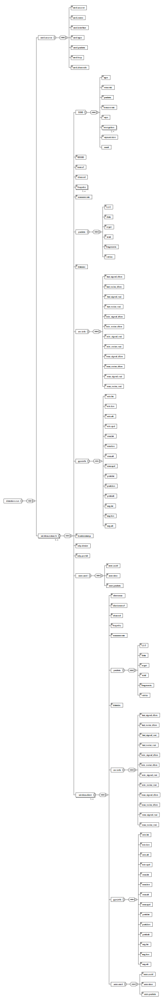

# powerKiss

Powershell Module for converting Kismet output files

## Overview

powerKiss is a collection of cmdlets that operate on kismet .netxml files and generate .csv files.  These .csv files are intended to be imported into a MySQL database.  Each .csv file is named after the corresponding table it is intended to be imported into.

## Usage

Generate .csv files for the "cardSource" table from all the .netxml files in the current directory:

```powershell
cardSourceTable
```

Stitch all the .csv files in the current directory for the "cardSource" table into one .csv file:

```powershell
cardSourceStitch
```

Each function has a prefix which is the table name and a suffix which is the command to either generate the .csv files (Table) or stitch the .csv files together (Stitch). 

The outputs that are generated from each individual "Stitch" command can be concatenated with the "stitchAll" cmdlet.  This cmdlet is intended to be used when all the tables have been generated and stitched and a single .csv file for each table to be imported is desired.

```powershell
stitchAll
```

### Functions

Each function is intended to be used from the command line in a directory with the desired .netxml files.  It will parse the current working directory for .netxml files and generate the corresponding table based on the cmdlet called.  The output .csv file will be named after the kismet .netxml file and its corresponding table.

### Tables

The following tables are generated in .csv format by their respective functions:

* cardSource
* detectionRun
* stitchAll

* wirelessClient
* wirelessClientGPSInfo
* wirelessClientPackets
* wirelessClientSNRInfo
* wirelessClientSeenCard

* wirelessNetwork
* wirelessNetworkFreqMHZ
* wirelessNetworkGPSInfo
* wirelessNetworkPackets
* wirelessNetworkSNRInfo
* wirelessNetworkSSID
* wirelessNetworkSSIDEncryption
* wirelessNetworkSeenCard

### Workflow

* Move desired .netxml files into a blank directory
* Call each function as needed to generate .csv files for MySQL import
* Stitch output .csv files together into a composite .csv file for each table

### Kismet .netxml Diagram

The .netxml file can be represented as follows:


This diagram illustrates the .csv files generated that are tables populated with data extracted from the .netxml file.